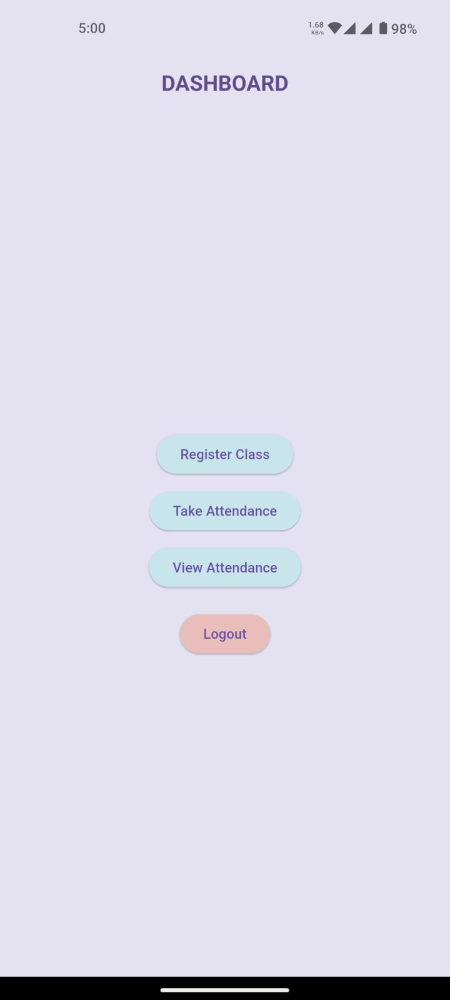
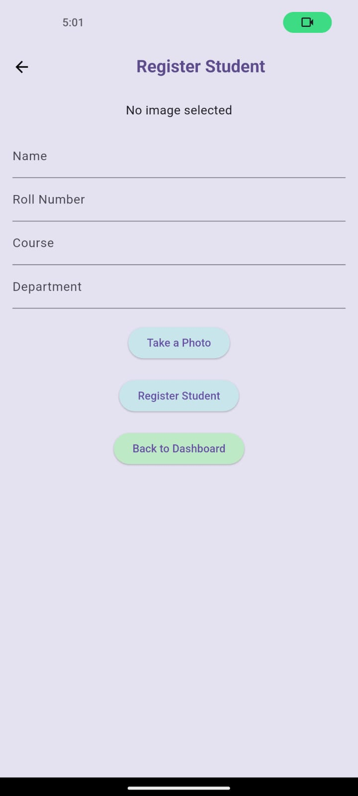
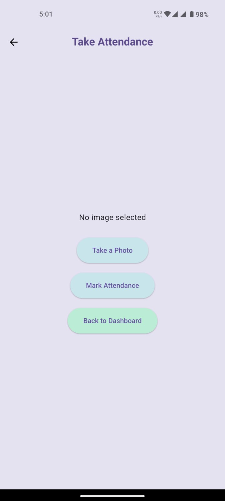
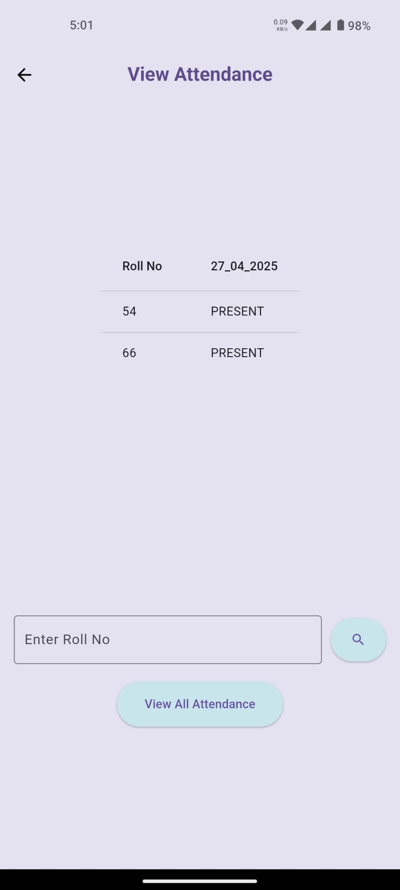

# SwiftVision

SwiftVision is a Face Recognition-based Attendance System that connects a Flutter frontend, a Python Flask backend, and uses Firebase and MySQL for managing student attendance.

---

## How SwiftVision Works

### 1. Login (Google Authentication)
- Users log in through the Flutter app using Google Sign-In.
- Firebase Authentication handles secure login.


---

### 2. Dashboard Options

After login, users see the following options:

- Register Student
- Take Attendance
- View Attendance
- Logout


---

### 3. Register Student

- In the Flutter app:
  - User enters student details (name, roll number, etc.).
  - Captures a photo of the student.
- The app sends:
  - Photo and details  → to the PC using Flask HTTP API.
- The Flask backend:
  - Stores the photo locally on the PC, named as the student's roll number (e.g., `2101.jpg`).
  - Saves the student details in MySQL and Firebase for redundancy.
  

---

### 4. Take Attendance

- The Flutter app:
  - Captures a new photo for attendance.
  - Sends it to the Flask backend.
- The backend:
  - Uses MTCNN to detect and recognize the face from the photo.
  - Compares it with locally stored images (by roll number).
  - If a match is found:
    - Extracts the roll number.
    - Marks attendance in:
      - MySQL
      - Firebase Firestore


---

### 5. View Attendance

- The app sends a request to the Flask backend.
- Flask fetches the data from Firebase Firestore.
- Sends it back to the Flutter app to display attendance history.


---

## Technologies Used

- Frontend: Flutter
- Authentication: Firebase Auth (Google Sign-In)
- Backend: Python + Flask
- Face Detection: MTCNN (via OpenCV)
- Databases: Firebase Firestore & MySQL
- Local Storage: Student images saved as `<rollno>.jpg` on PC

---

## Setup Instructions

1. **Flutter**: Make a new flutter project copy the files
2. **Firebase**: Set up Firebase for your Flutter project and enable Firebase Authentication and Firestore.
3. **Flask** : In flutter add your ip address in register , take attendance  and view attendance pages after that do:
   ```bash
     flutter pub get
     flutter run   
4. **Python**: Install Python 3.9+ and required libraries (OpenCV, Flask, etc.) for the backend and run swiftAPI.py.
   ```bash
   pip install mtcnn mysql-connector-python firebase-admin opencv-python flask
   python lib/backend/swiftAPI.py
